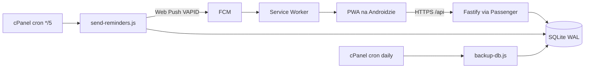

# Rodzina - rodzinna aplikacja PWA (plan projektu)

Ten dokument jest samowystarczalny i przeznaczony do przekazania agentowi AI lub nowemu kontrybutorowi. W fazie 0 trafia do repo jako `docs/PLAN.md`. Każda faza ma zakres, kryteria akceptacji i listę rzeczy poza zakresem.

## 1. Kontekst dla agenta

- **Produkt.** Aplikacja do zarządzania życiem rodzinnym. Rodzina ma jedno konto, a w nim wielu domowników.
- **Widoczność.** Wydarzenia, zakupy, obiady i dokumenty widzi cała rodzina. Wyjątkiem są listy zadań (faza 6): widzi je właściciel i domownicy, którym je udostępnił.
- **Platforma docelowa: Android** (Chrome, PWA zainstalowana na ekranie głównym). Ale aplikacja powinna też bez problemu działać na desktop na przeglądarce chrome
- **Hosting docelowy.** Współdzielony hosting cPanel w vh.pl, aplikacja pod subdomeną istniejącej domeny właściciela, przez HTTPS. Właściciel ma już na tym hostingu aplikację wdrożoną tą samą metodą (zip, aplikacja w cPanel, Phusion Passenger, SQLite w katalogu danych). Wzorzec deployu: [portfel/DEPLOY.md](https://github.com/WojciechPreficz/portfel/blob/main/DEPLOY.md). Wzorujemy się tylko na sposobie wdrożenia, nie na stacku.
- **Fazy 0-7 są realizowane i testowane wyłącznie lokalnie.** Faktyczne wdrożenie na serwer to osobna faza 8, wykonywana dopiero po ukończeniu faz 0-7. W każdej fazie aplikacja musi jednak pozostawać **gotowa do wdrożenia** (sekcja 1.1).
- **Język.** UI wyłącznie po polsku. Kod, nazwy, komentarze i commity po angielsku. README i dokumentacja w `docs/` po polsku.
- **Zasada pracy.** Agent realizuje **jedną fazę naraz**. Kończy ją dopiero wtedy, gdy wszystkie kryteria akceptacji są spełnione oraz przechodzą `npm run lint`, `npm run typecheck`, `npm test`, `npm run build` i `npm run release:smoke`. Każdą decyzję, której plan nie rozstrzyga, zapisuje w `docs/DECISIONS.md` (data, decyzja, powód).

### 1.1 Gotowość do deployu w każdej fazie (Definition of Done)

Każda faza, która to dotyczy, musi:

- dopisać nowe zmienne środowiskowe do `apps/api/.env.example` (z komentarzem) i do sekcji konfiguracji w `docs/DEPLOY.md`;
- dopisać nowe zadania okresowe do sekcji crona w `docs/DEPLOY.md`, z gotową linią do wklejenia w cPanel;
- commitować wygenerowane migracje Drizzle, bo serwer uruchamia je przy starcie;
- zapewnić, że nowe zależności runtime nie wymagają kompilacji na serwerze. Jeśli wymagają, trzeba to oznaczyć w `DECISIONS.md` i dodać jako external w `build-release.mjs`;
- przejść `npm run release:smoke`: zip jest rozpakowywany do katalogu tymczasowego, instalowane są zależności produkcyjne, startuje `server.cjs` z testowym `.env`, a skrypt sprawdza `/api/health` i serwowanie `index.html`;
- nie zakładać niczego, czego nie ma na cPanel: brak stałego procesu w tle, brak WebSocketów, brak Dockera, brak Redisa.

### Szablon polecenia dla agenta

```text
Przeczytaj AGENTS.md oraz docs/PLAN.md. Zrealizuj wyłącznie Fazę N.
Nie implementuj niczego z sekcji "Poza zakresem" ani z kolejnych faz.
Nie wdrażaj niczego na serwer - testujemy lokalnie (poza fazą 8).
Zanim zaczniesz, wypisz listę plików, które utworzysz/zmienisz.
Na koniec pokaż, jak spełniłeś każde kryterium akceptacji
oraz punkty "Gotowość do deployu" z sekcji 1.1.
```


### Testowanie na Androidzie lokalnie (bez serwera)

Service worker, instalacja PWA i push wymagają bezpiecznego kontekstu, czyli HTTPS albo `localhost`. Lokalnie używamy **przekierowania portów w Chrome**:

1. Podłącz telefon przez USB i włącz debugowanie USB.
2. Na komputerze otwórz `chrome://inspect`, wybierz Port forwarding i ustaw `5173 -> localhost:5173` (tryb dev) oraz `3000 -> localhost:3000` (build produkcyjny z `npm start`).
3. Na telefonie otwórz `http://localhost:5173` albo `http://localhost:3000`.

Telefon traktuje tę stronę jak `localhost`, więc da się zainstalować PWA i odebrać push. **Instalację PWA, service worker i push testujemy na buildzie produkcyjnym (`npm run build && npm start`, port 3000)**, bo service worker w trybie dev Vite działa zawodnie. Tryb dev służy do pracy nad UI. Opis trafia do `docs/DEVELOPMENT.md` w fazie 0.

## 2. Podjęte decyzje (nie zmieniać bez wpisu w DECISIONS.md)

- **Nazwa robocza** repo i pakietu: `rodzina`.  Prefiks zmiennych środowiskowych: `RODZINA_`. Zmiana nazwy jest możliwa przed fazą 0.
- **Licencja:** MIT.
- **Runtime:** Node 24 . Node 20 nie jest już wspierany (koniec wsparcia: kwiecień 2026). W fazie 8 wybieramy najwyższą z tych wersji dostępną w cPanel - obecnie 24
- **Monorepo:** npm workspaces, bez Nx i bez Turborepo.
- **Frontend:** React 19, Vite, TypeScript (strict), React Router (tryb biblioteki), TanStack Query, Mantine (+ `@mantine/dates`, `@mantine/notifications`, `@mantine/form`), Schedule-X (`@schedule-x/react`) do widoku kalendarza, `vite-plugin-pwa` w trybie `injectManifest`.
- **Backend:** Fastify, `fastify-type-provider-zod`, Drizzle ORM + SQLite, `@node-rs/argon2` (prebuilt, bez kompilacji), `web-push`, `rrule`, `date-fns` + `@date-fns/tz`, `@fastify/cookie`, `@fastify/rate-limit`, `@fastify/static`.
- **Sterownik SQLite:** domyślnie `better-sqlite3`. Cała zależność od sterownika siedzi wyłącznie w `apps/api/src/db/client.ts`, żeby w fazie 8 dało się go podmienić na `@libsql/client` w jednym pliku, gdyby `better-sqlite3` nie zainstalował się na serwerze.
- **Wspólne typy:** `packages/shared` ze schematami zod. Front i API importują te same schematy.
- **Synchronizacja:** bez WebSocketów. TanStack Query z `refetchOnWindowFocus`, `refetchInterval: 20000` na aktywnych widokach i optymistycznymi mutacjami. Konflikty rozstrzyga reguła last-write-wins.
- **Testy:** Vitest (api, shared, web), Testing Library dla komponentów, Playwright (tylko headless) dla smoke e2e od fazy 1.
- **Format daty i czasu:**
  - Momenty w czasie (`created_at`, `next_fire_at` itp.) to integer ms UTC.
  - Daty i godziny wydarzeń to lokalny czas ściany w strefie rodziny: `start_date` jako `YYYY-MM-DD` i `start_time` jako `HH:mm` lub null dla całodniowych.
  - Przeliczenie na UTC wyłącznie w `packages/shared/src/time.ts`.
- **ID:** `crypto.randomUUID()` jako text.
- **Przypomnienia są wspólne dla modułów.** Jedna tabela `reminders` i jeden job wysyłki. Źródło przypomnienia to dokładnie jedno z pól: `event_id`, `task_id` (od fazy 6) albo `document_id` (od fazy 7). Treść powiadomienia buduje funkcja per źródło (`buildReminderPayload`).
- **Odbiorcy przypomnień (`audience`)**, z jedną funkcją `resolveRecipients(reminder, source)` w API:
  - `participants`: uczestnicy wydarzenia. Gdy wydarzenie nie ma uczestników, przypomnienie trafia do twórcy. Dotyczy tylko wydarzeń.
  - `family`: wszyscy domownicy, łącznie z dziećmi.
  - `adults`: domownicy z rolą `admin` lub `member`.
  - `owner`: osoba odpowiedzialna za źródło. Dla wydarzenia to twórca, dla zadania osoba przypisana albo (gdy jej brak) właściciel listy, dla dokumentu posiadacz albo (gdy jego brak) twórca.
  - `list_members` (od fazy 6): właściciel i członkowie listy zadań. Dotyczy tylko zadań.
  - `user`: jedna konkretna osoba wskazana w `reminders.user_id`. W UI to opcja "tylko ja", która ustawia `user_id` na osobę dodającą przypomnienie. Dostępna dla wszystkich źródeł.
- **Dozwolone wartości `audience` per źródło:**
  - wydarzenia: `participants`, `family`, `adults`, `owner`, `user`;
  - zadania: `owner`, `list_members`, `user`. **Nigdy `family` ani `adults`**, bo listy zadań mogą być prywatne;
  - dokumenty: `family`, `adults`, `owner`, `user`.
- **Kontrola dostępu przy wysyłce.** `resolveRecipients` zawsze odfiltrowuje osoby, które w chwili wysyłki nie widzą źródła. Przykład: członek, który opuścił listę zadań, przestaje dostawać jej przypomnienia, także te "tylko ja".
- **Awaryjny odbiorca.** Jeśli po odfiltrowaniu lista odbiorców jest pusta (np. twórca albo uczestnicy zostali usunięci), przypomnienie trafia do `adults`. Wyjątek stanowią zadania: przy pustej liście odbiorców job tylko zapisuje to w logu i niczego nie wysyła.
- **Przypomnienia wspólne i osobiste:**
  - Wspólne, czyli z `audience` innym niż `user`, są częścią edycji źródła i zapisuje je ten, kto ma prawo edytować źródło.
  - Osobiste (`audience=user`) mają osobne endpointy (faza 2) i może je ustawić każdy, kto widzi źródło, ale tylko dla siebie.
  - Zapis źródła nigdy nie zmienia ani nie usuwa cudzych przypomnień osobistych.
- **Przypomnienia po zmianie źródła.** Każda zmiana terminu, odhaczenie lub odznaczenie zadania, odnowienie dokumentu i edycja serii przeliczają `next_fire_at` przez `computeNextFireAt`. Ukończone zadanie ma `next_fire_at = null`, a po ponownym otwarciu przypomnienia są przeliczane od nowa.
- **Dwa typy przypomnień:**
  - `offset`: "N jednostek przed terminem", zapisane jako `offset_value` + `offset_unit` (`minute` | `hour` | `day` | `week` | `month`). Jednostki `day`, `week` i `month` liczymy **kalendarzowo w czasie lokalnym**: ta sama godzina lokalna N dni, tygodni albo miesięcy wcześniej. Dla terminów bez godziny bazą jest 09:00. Takie przypomnienie zawsze podąża za terminem, także po zmianie daty i po "Odnowiono".
  - `absolute`: konkretna data i godzina wybrana przez użytkownika w kalendarzu. Nie podąża za terminem. Jeśli po zmianie terminu znajdzie się w przeszłości, `next_fire_at = null`, a UI pokazuje je jako "nieaktualne" z opcją usunięcia.
  - UI tworzy `offset` dla wszystkich presetów i dla "N dni/tygodni/miesięcy przed", a `absolute` wyłącznie dla opcji "w wybranym dniu".
- **Usuwanie danych:**
  - Usunięcie wydarzenia, zadania, listy zadań albo dokumentu usuwa kaskadowo jego przypomnienia (FK `ON DELETE CASCADE`). Podobnie uczestników, wyjątki, pozycje i składniki.
  - Usunięcie domownika usuwa jego sesje, subskrypcje push, członkostwa w listach zadań, przypomnienia z `audience=user` wskazujące na niego i jego prywatne listy zadań. Listy udostępnione przechodzą na pierwszego członka z ustawieniem `is_default=false`, a gdy członków brak, są usuwane.
  - Przy usuwanym domowniku jego przypisania do zadań i bycie posiadaczem dokumentu zmieniają się na `null`, a jego udział w wydarzeniach jest usuwany.
  - Treści, które utworzył (`created_by`), zostają, a w UI wyświetlają się jako "były domownik".
  - **Klucze obce do `users`:** wszystkie kolumny wskazujące osobę, która coś zrobiła albo za coś odpowiada (`created_by` we wszystkich tabelach, `checked_by`, `done_by`, `assignee_id`, `holder_user_id`), są nullable z `ON DELETE SET NULL`. W UI `null` wyświetla się jako "były domownik". Kaskadowo (`ON DELETE CASCADE`) usuwane są tylko: `sessions`, `push_subscriptions`, `password_resets`, `event_participants`, `task_list_members` i `reminders` z `audience=user`. Listy zadań obsługuje reguła przeniesienia opisana wyżej, wykonywana w serwisie przed usunięciem użytkownika.

## 3. Ograniczenia hostingu i jak je obchodzimy

- **Passenger usypia proces.** Brak schedulera w pamięci, wszystkie zadania okresowe idą przez **cron z cPanel**. Lokalnie job uruchamia się ręcznie przez `npm run job:reminders` albo w pętli przez `npm run dev:cron`.
- **Zmienne środowiskowe** ustawione w panelu aplikacji Node nie są widoczne dla crona. Dlatego cała konfiguracja jest w pliku `~/rodzina-data/.env`. Serwer wczytuje go przez `process.loadEnvFile(process.env.RODZINA_ENV_FILE ?? '<home>/rodzina-data/.env')` w `server.cjs`, a joby przez flagę `node --env-file=...`. Lokalnie używamy `apps/api/.env`.
- **ESM pod Passengerem.** Plik startowy to `server.cjs` (CommonJS), który robi `import('./dist/server.js')`. Fastify nasłuchuje na `process.env.PORT ?? 3000`.
- **Ścieżki w paczce release.** Wszystkie ścieżki do plików (frontend, migracje) są liczone względem katalogu `server.cjs`, a nie względem repo. Frontend w paczce leży w `public/` (zmienna `RODZINA_WEB_DIR`, domyślnie `./public`), a migracje w `drizzle/`. Lokalnie `server.cjs` leży w `apps/api/`, więc `apps/api/.env.example` zawiera `RODZINA_WEB_DIR=../web/dist`.
- **Moduły ES.** Produkcyjny `package.json` w paczce ma `"type": "module"`, żeby `dist/*.js` ładowały się jako ESM. `server.cjs` dzięki rozszerzeniu pozostaje CommonJS.
- **Dwa procesy na jednej bazie** (serwer i cron). SQLite działa w trybie `journal_mode=WAL` z `busy_timeout=5000`.
- **HTTPS** zapewnia AutoSSL w cPanel (faza 8). Aplikacja w produkcji ustawia cookie `Secure`, a za proxy Passengera ufa nagłówkom `X-Forwarded-`* (`trustProxy: true`).
- **Brak wysyłki e-maili w MVP.** Zaproszenia i reset hasła działają przez link generowany w aplikacji, który admin przekazuje np. przez komunikator.




## 4. Struktura repo (docelowa)

```text
rodzina/
  AGENTS.md                 # instrukcje dla agentów (stack, komendy, konwencje)
  README.md                 # PL; w fazie 0 krótki, pełny w fazie 9
  LICENSE                   # MIT; dodawany w fazie 9 (opcjonalnej)
  docs/
    PLAN.md                 # ten dokument
    DECISIONS.md
    DEVELOPMENT.md          # uruchomienie lokalne, testy na Androidzie
    DEPLOY.md               # instrukcja cPanel krok po kroku (PL), rozwijana w każdej fazie
  package.json              # workspaces + skrypty root
  tsconfig.base.json
  eslint.config.mjs
  .prettierrc.json          # 120 znaków, single quotes, trailing commas
  .github/workflows/ci.yml
  scripts/
    build-release.mjs       # cross-platform, tworzy release.zip
    smoke-release.mjs       # rozpakowuje zip, instaluje prod deps, startuje server.cjs, sprawdza health
    generate-vapid.mjs
  packages/shared/src/
    schemas/                # zod: auth, events, reminders, shopping, meals, tasks, documents
    time.ts                 # strefy czasu, rozwijanie RRULE, liczenie przypomnień
    index.ts
  apps/api/
    server.cjs              # plik startowy Passengera
    .env.example
    drizzle.config.ts
    drizzle/                # wygenerowane migracje (commitowane)
    src/
      server.ts             # bootstrap: config, db, migracje, app.listen
      app.ts                # buildApp() - używane też w testach
      config.ts             # walidacja env przez zod
      db/schema.ts, db/client.ts
      plugins/              # auth (sesja -> request.user), errors, static
      modules/<moduł>/      # routes.ts, service.ts, repository.ts, *.test.ts
      jobs/send-reminders.ts, jobs/backup-db.ts
  apps/web/
    index.html
    vite.config.ts          # proxy /api -> :3000 w dev, changeOrigin: false
    public/icons/           # 192, 512, maskable
    src/
      main.tsx, router.tsx, sw.ts
      api/                  # klient fetch + hooki TanStack Query per moduł
      i18n/pl.ts            # wszystkie teksty UI w jednym obiekcie
      features/<moduł>/     # strony i komponenty
      components/           # wspólne (AppShell, BottomNav, EmptyState)
```

### Skrypty root (`package.json`)

- `dev`: równolegle API (`tsx watch --env-file=apps/api/.env apps/api/src/server.ts`, port 3000) i Vite (port 5173 z proxy `/api`)
- `start`: uruchamia zbudowaną aplikację produkcyjnie (`node apps/api/server.cjs` z `RODZINA_ENV_FILE=apps/api/.env`, port 3000, API i frontend razem). Używa tego samego portu co API w `dev`, więc oba nie mogą działać jednocześnie, co trzeba opisać w `DEVELOPMENT.md`.
- `dev:cron`: uruchamia joby co minutę lokalnie (symulacja crona)
- `job:reminders`, `job:backup`: jednorazowe uruchomienie joba
- `build`: shared, web, api (bundling przez `tsup`, natywne zależności jako external)
- `lint`, `format`, `format:check`, `typecheck`, `test`, `test:e2e` (Playwright headless)
- `db:generate` (drizzle-kit generate), `db:migrate`
- `release`: `node scripts/build-release.mjs`
- `release:smoke`: `node scripts/smoke-release.mjs`
- `vapid:generate`

### Konwencje API

- Prefiks `/api`, JSON, walidacja zod na wejściu i wyjściu.
- Błędy mają postać `{ "error": { "code": "VALIDATION_ERROR" | "UNAUTHORIZED" | "FORBIDDEN" | "NOT_FOUND" | "CONFLICT" | "RATE_LIMITED", "message": "<po polsku, do pokazania w UI>" } }`.
- Każdy endpoint wymaga sesji, z wyjątkiem: `GET /api/health`, `POST /api/auth/register-family`, `POST /api/auth/login`, `POST /api/auth/login-child`, `GET /api/auth/family-members`, `GET /api/invitations/:token`, `POST /api/invitations/:token/accept` i `POST /api/auth/reset-password`.
- `family_id` **zawsze** pochodzi z sesji, nigdy z body ani z URL. Repozytoria przyjmują `familyId` jako pierwszy argument.
- Mutacje wymagają `Content-Type: application/json`, a nagłówek `Origin` musi mieć ten sam host co host żądania (ochrona CSRF razem z cookie `SameSite=Lax`). Nie porównujemy z `RODZINA_PUBLIC_URL`, żeby działały zarówno `localhost:5173` (proxy Vite), jak i `localhost:3000`, a na serwerze subdomena. Szczegóły:
  - Host żądania bierzemy z `request.host` Fastify. Przy `trustProxy: true` uwzględnia on `X-Forwarded-Host` za Passengerem.
  - Proxy Vite w `vite.config.ts` **musi mieć `changeOrigin: false`**. Inaczej Vite podmieni `Host` na `localhost:3000` i każda mutacja w dev dostanie 403.
  - Test API: mutacja z obcym `Origin` dostaje 403, a z właściwym przechodzi.
- Każda encja domenowa (wydarzenie, pozycja zakupów, obiad, zadanie, dokument) ma `createdAt`, `updatedAt` i `createdBy`. Tabele pomocnicze (uczestnicy, składniki, członkostwa) nie muszą.

## 5. Model danych (całość)

- `families`: id, name, timezone (stała `Europe/Warsaw`, bez edycji w MVP), join_code (6 znaków, do logowania dzieci), created_at
- `users`: id, family_id, display_name, email (unique, nullable), password_hash (nullable), pin_hash (nullable), role (`admin` | `member` | `child`), color (hex), created_at, updated_at
- `sessions`: id (sha256 tokenu), user_id, expires_at, created_at, user_agent
- `invitations`: id, family_id, token_hash, role, created_by, expires_at (7 dni), used_at
- `password_resets`: id, user_id, token_hash, expires_at (24h), used_at
- `events`: id, family_id, title, description, location, start_date, start_time (nullable), duration_minutes (nullable dla całodniowych), date_precision (`day` | `month`), rrule (nullable, bez DTSTART), kind (`single` | `recurring` | `distant`), created_by, created_at, updated_at
- `event_participants`: event_id, user_id
- `event_exceptions`: id, event_id, original_date, is_cancelled, override_start_date, override_start_time, override_duration_minutes, override_title
- `reminders`: id, family_id, event_id (nullable), task_id (nullable, faza 6), document_id (nullable, faza 7), type (`offset` | `absolute`), offset_value (integer, nullable), offset_unit (`minute` | `hour` | `day` | `week` | `month`, nullable), remind_at (nullable, ms UTC, tylko dla `absolute`), audience (`participants` | `family` | `adults` | `owner` | `user`, od fazy 6 także `list_members`; znaczenie w sekcji 2), user_id (nullable, wymagane przy `audience=user`), created_by, next_fire_at (nullable), last_sent_at (nullable). Walidacja w serwisie: dokładnie jedno ze źródeł jest ustawione.
- `push_subscriptions`: id, user_id, endpoint (unique), p256dh, auth, user_agent, created_at, last_success_at
- `shopping_lists`: id, family_id, name, position, created_at
- `shopping_items`: id, list_id, name, quantity (text), category, is_checked, checked_by, checked_at, position, created_by, created_at, updated_at
- `shopping_history`: family_id, name_normalized, display_name, category, use_count, last_used_at (do podpowiedzi)
- `meals`: id, family_id, date, slot (`dinner`, enum rozszerzalny), title, notes, created_by, updated_at
- `meal_ingredients`: id, meal_id, name, quantity
- `task_lists` (faza 6): id, family_id, owner_id, name, is_default, position, created_at, updated_at
- `task_list_members` (faza 6): list_id, user_id
- `tasks` (faza 6): id, list_id, title, notes, due_date (nullable), due_time (nullable), assignee_id (nullable), is_done, done_by, done_at, position, created_by, created_at, updated_at
- `documents` (faza 7): id, family_id, type (`id_card` | `passport` | `car_insurance` | `car_inspection` | `other`), label, holder_user_id (nullable), vehicle_label (nullable), expires_on (`YYYY-MM-DD`), notes, created_by, created_at, updated_at

## 6. Fazy

---

### Faza 0 - szkielet, jakość i paczka wdrożeniowa

**Cel:** pusta aplikacja działa lokalnie w trybie dev i w trybie produkcyjnym z paczki release, jest instalowalna jako PWA na Androidzie (przez przekierowanie portów), a lokalny "cron" potrafi zapisać do SQLite.

**Zakres:**

- Monorepo według sekcji 4, `tsconfig` strict, ESLint (flat config) i Prettier.
- `AGENTS.md` ze stackiem, komendami i konwencjami API oraz regułami: "jedna faza naraz", "Playwright tylko headless", "gotowość do deployu (sekcja 1.1 PLAN.md)" i "nie wdrażamy na serwer przed fazą 8". Do repo trafiają też `docs/PLAN.md` (ten dokument), `docs/DECISIONS.md` i `docs/DEVELOPMENT.md`.
- API:
  - `config.ts` (zod, m.in. `NODE_ENV`, `RODZINA_DATABASE_PATH`, `RODZINA_WEB_DIR`, `RODZINA_PUBLIC_URL`, `RODZINA_ALLOW_REGISTRATION`) oraz `apps/api/.env.example`. Sesje to losowe tokeny przechowywane w bazie jako hash, więc nie ma sekretu do podpisywania cookie.
  - Drizzle z tabelą techniczną `job_runs` (id, job, ran_at) i migracje uruchamiane przy starcie.
  - `GET /api/health` zwracające `{ ok: true, version, dbOk }`.
- API w produkcji serwuje katalog `RODZINA_WEB_DIR` przez `@fastify/static` z fallbackiem SPA na `index.html` dla ścieżek innych niż `/api`. W paczce release to `public/` obok `server.cjs`, a przy `npm start` w repo `apps/web/dist`. `trustProxy: true`.
- `server.cjs` wczytuje `.env` przez `process.loadEnvFile` i importuje `dist/server.js`.
- Web:
  - Mantine `AppShell` z dolną nawigacją (Kalendarz, Zakupy, Obiady, Więcej) i pustymi stronami.
  - Manifest: `name` "Rodzina", `lang` "pl", `display` "standalone", ikony 192/512/maskable, `theme_color`.
  - `sw.ts` z precache app shella.
- Job `jobs/heartbeat.ts`, który zapisuje wiersz do `job_runs`. Służy do weryfikacji crona i później zostanie usunięty.
- `scripts/build-release.mjs` tworzy `release.zip` z:
  - `server.cjs` i `dist/` z API
  - `public/` ze zbudowanym webem
  - `drizzle/` z migracjami
  - produkcyjnym `package.json`, który zawiera wyłącznie zależności natywne i external
- `scripts/smoke-release.mjs` rozpakowuje zip do katalogu tymczasowego, uruchamia `npm install --omit=dev`, startuje `node server.cjs` z tymczasowym `.env` i bazą, sprawdza `/api/health` i `/`, uruchamia `node --env-file=... dist/jobs/heartbeat.js` i sprawdza wpis w `job_runs`, a na koniec sprząta.
- `docs/DEPLOY.md` (PL, **instrukcja na fazę 8, nie wykonywana teraz**):
  - utworzenie subdomeny i SSL (AutoSSL)
  - **Setup Node.js App** (wersja Node, app root, startup file `server.cjs`)
  - Run NPM Install
  - katalog `~/rodzina-data/` i plik `.env`
  - wpisy crona z pełną ścieżką do node z nodevenv
  - restart przez `tmp/restart.txt`
  - checklista weryfikacji po wdrożeniu
- CI (`.github/workflows/ci.yml`): `npm ci`, lint, typecheck, test, build i `release:smoke` na Node 22 i 24.

**Kryteria akceptacji:**

- `npm run dev` otwiera aplikację z działającą dolną nawigacją, a `/api/health` zwraca `dbOk: true`.
- `npm run release:smoke` przechodzi lokalnie i w CI.
- `npm run build && npm start` serwuje aplikację na porcie 3000. Chrome DevTools pokazuje w zakładce Application poprawny manifest i aktywny service worker. Na telefonie z Androidem (przez przekierowanie portu 3000) da się zainstalować aplikację i otworzyć ją w trybie standalone.
- `DEPLOY.md` zawiera komplet kroków dla fazy 8.
- CI jest zielone.

**Poza zakresem:** wdrożenie na serwer, logowanie, jakiekolwiek moduły domenowe, push.

---

### Faza 1 - konta rodziny i domownicy

**Cel:** rodzina zakłada konto, admin dodaje domowników, a każdy loguje się na swoim telefonie i pozostaje zalogowany.

**Endpointy:**

- `POST /api/auth/register-family` z `{ familyName, displayName, email, password }`. Tworzy rodzinę i admina, loguje. Wyłączone, gdy `RODZINA_ALLOW_REGISTRATION=false` (wtedy 403).
- `POST /api/auth/login` z `{ email, password }`.
- `POST /api/auth/login-child` z `{ joinCode, userId, pin }`.
- `GET /api/auth/family-members?joinCode=` zwraca wyłącznie `id`, imię i kolor dzieci (do ekranu wyboru profilu, `id` trafia potem do `login-child`).
- `POST /api/auth/logout`, `GET /api/auth/me` (zwraca user i family).
- `POST /api/invitations` z `{ role: 'admin' | 'member' }` (admin). Zwraca link `${PUBLIC_URL}/zaproszenie/<token>`. Konta dzieci nie powstają przez zaproszenia, tylko przez `POST /api/members/child`.
- `GET /api/invitations/:token` (podgląd: nazwa rodziny), `POST /api/invitations/:token/accept` z `{ displayName, email, password }`.
- `GET /api/members`.
- `POST /api/members/child` z `{ displayName, pin, color }` (admin).
- `PATCH /api/members/:id` (admin albo sam użytkownik: imię, kolor; admin: rola i nowy PIN dziecka).
- `DELETE /api/members/:id` (admin, nie można usunąć ostatniego admina).
- `POST /api/members/:id/password-reset-link` (admin), `POST /api/auth/reset-password` z `{ token, password }`.
- `PATCH /api/family` (admin: nazwa; strefa czasu jest stała `Europe/Warsaw`), `POST /api/family/join-code/rotate` (admin).

**Zasady:**

- Hasła: argon2id, minimum 8 znaków. PIN: 4-6 cyfr, również hashowany.
- Sesja to losowy token 32 bajty w cookie `sid` (`httpOnly`, `Secure` w produkcji, `SameSite=Lax`). Jest ważna 60 dni i przedłużana przy aktywności, bo PWA ma pozostać zalogowana.
- Rate limit: 10 prób logowania na 15 minut na IP i login.
- Uprawnienia ról, obowiązujące we wszystkich kolejnych fazach:
  - `admin`: wszystko, w tym zarządzanie domownikami.
  - `member`: tworzy, edytuje i usuwa wszystkie wspólne treści rodziny.
  - `child`, według modułów:
    - Kalendarz: przegląda, tworzy wydarzenia, a edytuje i usuwa tylko te, które sam utworzył.
    - Zakupy: przegląda, dodaje pozycje i odhacza dowolne pozycje. Edytuje i usuwa tylko własne pozycje. Nie może użyć "Wyczyść kupione" ani zarządzać listami.
    - Obiady (faza 5): tylko odczyt.
    - Zadania (faza 6): pełne prawa do własnych list i do list, które mu udostępniono, na zasadach tej fazy.
    - Dokumenty (faza 7): tylko odczyt.
    - Rodzina: zmienia tylko własne imię i kolor.

**Ekrany:**

- Powitanie z wyborem "Załóż rodzinę", "Zaloguj się" i "Jestem dzieckiem".
- Rejestracja i logowanie.
- Logowanie dziecka: kod rodziny, kafelki z imionami, klawiatura PIN.
- Akceptacja zaproszenia i reset hasła.
- Więcej, a w nim Rodzina: lista domowników z kolorami, generowanie zaproszenia z przyciskiem kopiuj/udostępnij (Web Share API), dodanie dziecka, kod rodziny.

**Kryteria akceptacji:**

- Testy API (`app.inject`, baza `:memory:`) pokrywają: rejestrację, logowanie poprawne i błędne, rate limit, zaproszenie (ważne, wygasłe, użyte), logowanie dziecka, izolację rodzin (użytkownik rodziny A dostaje 404 na zasobach rodziny B) i uprawnienia ról.
- Smoke e2e (Playwright headless): rejestracja, wygenerowanie zaproszenia, akceptacja w drugim kontekście przeglądarki i widoczność obu osób na liście.
- Po zamknięciu i ponownym otwarciu PWA na Androidzie użytkownik nadal jest zalogowany.
- Spełnione punkty z sekcji 1.1 (nowe zmienne w `.env.example` i `DEPLOY.md`, `release:smoke` zielony).

**Poza zakresem:** e-maile, logowanie przez Google, 2FA, wiele rodzin na jednym użytkowniku, zmiana strefy czasowej rodziny.

---

### Faza 2 - kalendarz

**Cel:** wspólny kalendarz z trzema trybami tworzenia wydarzeń oraz definiowaniem przypomnień. Wysyłka przypomnień przychodzi w fazie 3.

**Reguły walidacji wydarzeń** (schemat zod w `shared`):

- `kind=single`: `rrule` = null, `date_precision` = `day`.
- `kind=recurring`: `rrule` wymagane, `date_precision` = `day`.
- `kind=distant`: `rrule` = null, `date_precision` = `day` albo `month`. Przy `month` pola `start_date` przechowuje pierwszy dzień miesiąca, a `start_time` i `duration_minutes` są null (wydarzenie całodniowe).
- Wydarzenia `distant` z precyzją `month` **nie są zwracane przez `/api/occurrences`** i nie pojawiają się w siatce kalendarza. Widać je tylko w sekcji "Odległe terminy" jako "maj 2028". Wydarzenia `distant` z precyzją `day` pojawiają się w obu miejscach.

**Logika w `packages/shared/src/time.ts`** (pokryta testami jednostkowymi):

- `expandOccurrences(event, exceptions, fromDate, toDate, tz)`:
  - RRULE rozwijane w czasie "floating", jako lokalne daty bez strefy.
  - Zastosowanie wyjątków.
  - Konwersja na UTC przez `@date-fns/tz`.
  - Zwraca `{ eventId, occurrenceDate, startUtc, endUtc, allDay, isException }`.
- `computeNextFireAt(reminder, source, nowUtc, tz)`:
  - Dla `offset` to najbliższe przyszłe wystąpienie (albo termin) minus `offset_value` × `offset_unit`. `minute` i `hour` odejmujemy od momentu UTC, a `day`, `week` i `month` od lokalnej daty, z zachowaniem lokalnej godziny (`@date-fns/tz`, `subDays`/`subWeeks`/`subMonths`). Przy `month`, gdy dzień nie istnieje, bierzemy ostatni dzień miesiąca: "1 miesiąc przed 31 marca" to 28 lub 29 lutego.
  - Dla całodniowych, miesięcznych i dat bez godziny bazą jest godzina 09:00 lokalnie w dniu (dla `date_precision=month` pierwszy dzień miesiąca).
  - Dla `absolute` to `remind_at`, o ile jest w przyszłości.
  - Funkcja przyjmuje źródło jako "coś z terminem lub wystąpieniami", żeby fazy 6 i 7 użyły jej bez zmian.
- Obowiązkowe testy:
  - Wydarzenie cykliczne przed i po zmianie czasu: ostatnia niedziela marca i ostatnia niedziela października. Zajęcia "wtorek 17:00" zawsze o 17:00 lokalnie.
  - `UNTIL` i `COUNT`.
  - Wyjątek anulowany i przesunięty.
  - Wydarzenie odległe za 2 lata z trzema przypomnieniami.
  - "1 dzień przed" dla zajęć we wtorek 17:00, gdy noc zmiany czasu wypada między przypomnieniem a zajęciami: przypomnienie przychodzi w poniedziałek o 17:00 lokalnie.
  - "3 miesiące przed" dla terminu 31 maja przypada na 28 lutego (albo 29 w roku przestępnym), a "1 miesiąc przed 31 marca" na ostatni dzień lutego.
  - Przypomnienie `offset` po przesunięciu daty wydarzenia podąża za nową datą, a `absolute` nie.

**Endpointy:**

- `GET /api/occurrences?from=YYYY-MM-DD&to=YYYY-MM-DD&userId=` zwraca rozwinięte wystąpienia (maksymalny zakres 62 dni) z danymi do wyświetlenia (tytuł, kolory uczestników).
- `GET /api/events/upcoming-distant` zwraca wydarzenia `kind=distant` posortowane po dacie.
- `GET /api/events/:id` (z uczestnikami, przypomnieniami i wyjątkami), `POST /api/events`.
- `PATCH /api/events/:id?scope=all|this|following&occurrenceDate=`:
  - `this` tworzy lub aktualizuje wyjątek.
  - `following` kończy serię przez `UNTIL` w dniu poprzedzającym i tworzy nową serię od `occurrenceDate`, kopiując uczestników i **wszystkie** przypomnienia, wspólne i osobiste. Osobiste zachowują `user_id` i `created_by`. Dzięki temu cudze "tylko ja" nie zostają przy zakończonej serii.
- `DELETE /api/events/:id?scope=all|this|following&occurrenceDate=` działa analogicznie (`this` oznacza wyjątek `is_cancelled`).
- **Przypomnienia wspólne** (`audience` inne niż `user`) są zapisywane w body wydarzenia (`reminders: [...]`) przez osoby, które mogą edytować wydarzenie. Tablica zastępuje wyłącznie przypomnienia wspólne i nie dotyka osobistych. Przy każdym zapisie serwer przelicza `next_fire_at`.
- **Przypomnienia osobiste** (`audience=user`) mają osobne, wspólne dla wszystkich modułów endpointy:
  - `GET /api/reminders/mine?eventId=|taskId=|documentId=` zwraca moje osobiste przypomnienia dla źródła;
  - `POST /api/reminders/mine` z `{ eventId | taskId | documentId, type, offsetValue?, offsetUnit? | remindAt? }` (serwer ustawia `audience=user`, `user_id` = zalogowany);
  - `DELETE /api/reminders/mine/:id` (tylko własne).
  - Wymagany jest tylko dostęp do odczytu źródła, więc dziecko może ustawić sobie przypomnienie o wydarzeniu utworzonym przez rodzica.
  - W fazie 2 obsługiwane jest `eventId`, a fazy 6 i 7 dokładają `taskId` i `documentId`.

**UI:**

- **Widok kalendarza** (Schedule-X):
  - Domyślnie miesiąc w trybie agendy, dodatkowo tydzień i dzień. Locale `pl-PL`, tydzień zaczyna się w poniedziałek.
  - Każdy domownik to osobny "calendar" Schedule-X z własnym kolorem. Filtr "pokaż tylko: [domownicy]".
  - Adapter `features/calendar/toScheduleX.ts` izoluje format dat biblioteki.
- **FAB "+"** otwiera wybór trybu: "Jednorazowe", "Powtarzające się", "Odległy termin".
- **Formularz wspólny:** tytuł, opis, miejsce, uczestnicy (multi-select domowników), całodniowe tak/nie, data, godzina, czas trwania, przypomnienia.
- **Tryb "Powtarzające się":** kreator bez wpisywania RRULE:
  - "Co [N] [dzień/tydzień/miesiąc/rok]".
  - Przy tygodniu wybór dni (pon-nd).
  - Zakończenie: nigdy, w dniu albo po N razach.
  - Podgląd tekstowy po polsku, np. "co tydzień we wtorek i czwartek do 30 czerwca".
- **Tryb "Odległy termin":** data z precyzją "dzień" albo "miesiąc" i lista przypomnień. Każde przypomnienie to "N dni/tygodni/miesięcy przed" (`offset` z jednostką kalendarzową) albo "w wybranym dniu" (`absolute`).
- **Presety przypomnień:** w chwili rozpoczęcia, 15 min, 1 godz., 1 dzień, 2 dni, 1 tydzień przed oraz własne. Wybór odbiorcy: uczestnicy (domyślnie), dorośli, cała rodzina albo "tylko ja". "Tylko ja" zapisuje się przez `/api/reminders/mine`, więc jest dostępne także dla osób, które nie mogą edytować wydarzenia (np. dziecka). Wtedy formularz pokazuje wyłącznie sekcję "Moje przypomnienia".
- **Szczegóły wydarzenia:** przy edycji lub usunięciu wystąpienia cyklu pytanie "Tylko to / To i następne / Wszystkie".
- **Sekcja "Odległe terminy"** na stronie kalendarza: lista najbliższych wydarzeń `distant` z odliczaniem ("za 1 rok i 7 mies.").

**Kryteria akceptacji:**

- Wszystkie testy `time.ts` przechodzą, łącznie z przypadkami zmiany czasu.
- Wydarzenie dodane w jednym kontekście przeglądarki pojawia się w drugim po maksymalnie 20 s albo od razu po powrocie do karty.
- Z `rrule` zapisanym przez kreator i odczytanym z powrotem kreator pokazuje te same ustawienia (test round-trip).
- Edycja "To i następne" nie zmienia przeszłych wystąpień.
- Dziecko nie może edytować cudzego wydarzenia, ani w API (403), ani w UI (brak przycisków), ale może dodać do niego własne przypomnienie przez `/api/reminders/mine`.
- Edycja wydarzenia przez jedną osobę nie usuwa osobistych przypomnień innych osób (test API).
- Edycja "To i następne" przenosi do nowej serii osobiste przypomnienia innych osób (test API).
- Usunięcie domownika nie usuwa wydarzeń, które utworzył: `created_by` staje się `null`, a UI pokazuje "były domownik" (test API).
- Spełnione punkty z sekcji 1.1.

**Poza zakresem:** wysyłka powiadomień, import i eksport iCal, załączniki, komentarze.

---

### Faza 3 - powiadomienia push (Android)

**Cel:** przypomnienia zdefiniowane w fazie 2 docierają jako push na zainstalowaną PWA na Androidzie. Lokalnie testujemy przez przekierowanie portów, a wszystko, co potrzebne na serwer (klucze VAPID w `.env`, crony), jest opisane w `DEPLOY.md`.

**Zakres:**

- `npm run vapid:generate` wypisuje `RODZINA_VAPID_PUBLIC_KEY`, `RODZINA_VAPID_PRIVATE_KEY` i `RODZINA_VAPID_SUBJECT` (mailto) do wklejenia w `.env`. Zmienne trafiają do `.env.example` i `DEPLOY.md`.
- Endpointy:
  - `GET /api/push/public-key`
  - `POST /api/push/subscriptions` (upsert po endpoint)
  - `DELETE /api/push/subscriptions` z `{ endpoint }`
  - `POST /api/push/test` (wysyła test na wszystkie urządzenia użytkownika)
- `sw.ts`:
  - `push` wywołuje `showNotification(title, { body, tag, data: { url }, icon, badge })`.
  - `notificationclick` fokusuje istniejące okno albo otwiera `data.url`.
- `jobs/send-reminders.ts`:
  - Przyjmuje opcjonalną flagę `--now=<ISO>`, która nadpisuje bieżący czas (do testów manualnych i jednostkowych).
  - **Rezerwacja w jednej transakcji SQLite** (`BEGIN IMMEDIATE`): wybiera `reminders` z `next_fire_at <= now` i od razu, w tej samej transakcji, ustawia im `last_sent_at = now` oraz **nowe `next_fire_at`** (kolejny termin wyliczony przez `computeNextFireAt` albo null dla jednorazowych). Dopiero po zatwierdzeniu transakcji wysyła powiadomienia. Dzięki temu drugie równoległe uruchomienie nie wybierze tych samych wierszy.
  - Treść buduje przez `buildReminderPayload` per źródło (na razie tylko wydarzenia), np. "Jutro 17:00: Basen (Zosia)" albo "Za 3 miesiące: USG nogi".
  - Odbiorców wyznacza przez `resolveRecipients` (sekcja 2).
  - Subskrypcje z odpowiedzią 404/410 usuwa.
  - Przypomnienia spóźnione o więcej niż 2 godziny (np. po awarii crona) rezerwuje tak samo, ale bez wysyłki, i loguje. Wyjątek: przypomnienia liczone od daty bez godziny (bazowa 09:00) mają tolerancję 12 godzin.
  - Loguje do stdout.
- `jobs/backup-db.ts`: `VACUUM INTO <RODZINA_BACKUP_DIR>/rodzina-YYYY-MM-DD.db`, przechowuje 14 ostatnich kopii. Nowa zmienna `RODZINA_BACKUP_DIR` trafia do `.env.example` i `DEPLOY.md`.
- `DEPLOY.md`:
  - cron co 5 min dla przypomnień i cron dzienny dla backupu, z przekierowaniem wyjścia do `~/rodzina-data/logs/`
  - usunięcie `heartbeat` (job i wpis)
- `smoke-release.mjs`: generuje testowe klucze VAPID do tymczasowego `.env` (konfiguracja ich wymaga, więc bez nich serwer nie wystartuje) i dodatkowo uruchamia `send-reminders.js` i `backup-db.js` z paczki (bez wysyłki, z pustą bazą).
- UI, sekcja Więcej > Powiadomienia:
  - Status (nieobsługiwane, zablokowane, włączone na tym urządzeniu).
  - Przycisk "Włącz powiadomienia". Prośba o zgodę wyłącznie po kliknięciu, nigdy automatycznie.
  - Przycisk "Wyślij testowe".
  - Krótka instrukcja instalacji PWA na Androidzie (Chrome, menu, "Zainstaluj aplikację").
- Baner w kalendarzu "Włącz powiadomienia, aby dostawać przypomnienia", pokazywany, gdy użytkownik ma przypomnienia, a nie ma subskrypcji.

**Kryteria akceptacji:**

- Test jednostkowy joba (mock `web-push`, sztuczny czas):
  - Przypomnienie wysyłane jest dokładnie raz, także przy dwóch równoległych uruchomieniach.
  - Cykliczne dostaje kolejne `next_fire_at`.
  - 410 usuwa subskrypcję.
  - Przy pustej liście odbiorców (usunięty twórca) przypomnienie trafia do dorosłych.
- Lokalnie na Androidzie, na buildzie produkcyjnym (`npm run build && npm start`, przekierowanie portu 3000, równolegle `npm run dev:cron`):
  - testowy push dociera,
  - przypomnienie "za 10 minut" przychodzi o czasie z dokładnością do cyklu crona,
  - kliknięcie powiadomienia otwiera szczegóły właściwego wystąpienia.
- Spełnione punkty z sekcji 1.1, w tym `release:smoke` z jobami.

**Poza zakresem:** iOS, powiadomienia o zmianach dokonanych przez innych, ciche godziny, e-mail/SMS.

---

### Faza 4 - lista zakupów

**Cel:** wspólna lista, której używa się w sklepie, także przy słabym zasięgu.

**Endpointy:**

- Listy: `GET/POST /api/shopping/lists`, `PATCH/DELETE /api/shopping/lists/:id`. Przy pierwszym wejściu powstaje domyślna lista "Zakupy".
- Pozycje:
  - `GET /api/shopping/lists/:id/items`
  - `POST /api/shopping/lists/:id/items` z `{ name, quantity?, category? }`
  - `PATCH /api/shopping/items/:id` (name, quantity, category, isChecked, position)
  - `DELETE /api/shopping/items/:id`
- `POST /api/shopping/lists/:id/clear-checked`.
- `GET /api/shopping/suggestions?q=` zwraca maksymalnie 8 pozycji z `shopping_history`, posortowanych po `use_count` i `last_used_at`.
- Dodanie pozycji aktualizuje `shopping_history`. Kategoria jest podpowiadana z historii, a jeśli jej tam nie ma, przyjmowana jest wartość `inne`.
- Kategorie to stała lista w `shared`:
  - warzywa i owoce, pieczywo, nabiał, mięso i ryby, mrożonki, suche i sypkie, napoje
  - chemia i higiena, dla dzieci, inne

**UI:**

- Zakładki list.
- Pole szybkiego dodawania na górze z podpowiedziami, z możliwością wpisania "mleko 2l": tekst po ostatniej spacji z cyfrą trafia do ilości.
- Pozycje pogrupowane po kategoriach. Tap odhacza: przekreślenie, przeniesienie na dół i pokazanie "kupił(a): Ania".
- Swipe albo menu: edytuj, usuń.
- Przycisk "Wyczyść kupione" z potwierdzeniem.

**Słaby zasięg:**

- `@tanstack/query-sync-storage-persister` (cache w localStorage) i mutacje z `networkMode: 'offlineFirst'`, wznawiane po powrocie sieci (`resumePausedMutations`).
- Baner "Jesteś offline - zmiany zostaną wysłane po odzyskaniu połączenia".
- Dotyczy tylko modułu zakupów.

**Kryteria akceptacji:**

- Testy API: CRUD, izolacja rodzin, podpowiedzi z historii, `clear-checked`.
- Test komponentu: parsowanie "mleko 2l" i "jajka 10 szt".
- Manualnie: w trybie offline (DevTools) da się odhaczyć 3 pozycje i dodać 1. Po włączeniu sieci zmiany są widoczne w drugim kontekście przeglądarki.
- Odhaczenie w jednym kontekście jest widoczne w drugim po maksymalnie 20 s.
- Spełnione punkty z sekcji 1.1.

**Poza zakresem:** ceny i budżet, skanowanie kodów, sortowanie według układu sklepu.

---

### Faza 5 - plan obiadów

**Cel:** rodzina planuje obiady na tydzień i jednym kliknięciem przenosi składniki do listy zakupów.

**Endpointy:**

- `GET /api/meals?weekStart=YYYY-MM-DD` (poniedziałek) zwraca 7 dni z posiłkami i składnikami.
- `PUT /api/meals/:date/:slot` z `{ title, notes?, ingredients: [{ name, quantity? }] }` (upsert), `DELETE /api/meals/:date/:slot`.
- `POST /api/meals/copy-week` z `{ fromWeekStart, toWeekStart, overwrite: boolean }`.
- `POST /api/meals/to-shopping-list` z `{ weekStart, listId, mealIds? }`. Dodaje składniki, scalając duplikaty po znormalizowanej nazwie (ilości są łączone tekstowo, np. "500 g + 1 kg"), i zwraca liczbę dodanych pozycji.
- `GET /api/meals/suggestions?q=` zwraca wcześniejsze tytuły obiadów razem z ostatnio użytymi składnikami (do szybkiego powtórzenia dania).

**UI:**

- Widok tygodnia (pon-nd) ze strzałkami poprzedni/następny tydzień i przyciskiem "dziś".
- Każdy dzień to karta z obiadem albo "+ Dodaj obiad".
- Formularz: nazwa dania z podpowiedziami (wybór podpowiedzi uzupełnia składniki), notatka, lista składników.
- Akcje tygodnia: "Skopiuj poprzedni tydzień", "Dodaj składniki do listy zakupów" (wybór listy i dań, potem podsumowanie).
- Karta "Dziś na obiad" na górze kalendarza (lekki dashboard).

**Kryteria akceptacji:**

- Testy API: upsert, copy-week z i bez overwrite, to-shopping-list ze scalaniem duplikatów oraz izolacja rodzin.
- Manualnie: zaplanowanie 5 obiadów i przeniesienie składników daje poprawnie pogrupowaną listę zakupów.
- Spełnione punkty z sekcji 1.1.

**Poza zakresem:** książka przepisów, wartości odżywcze, inne posiłki niż obiad. Kolumna `slot` jest już na to przygotowana.

---

### Faza 6 - listy zadań

**Cel:** każdy domownik ma własne listy zadań. Wybraną listę może udostępnić konkretnym domownikom, np. wspólną listę "Remont łazienki" dla obojga rodziców.

**Zasady widoczności i uprawnień:**

- Każdy użytkownik (także dziecko) dostaje przy pierwszym wejściu domyślną listę "Moje zadania" (`is_default=true`). Tej listy nie można usunąć.
- Listę widzi i edytuje jej **właściciel** oraz domownicy z `task_list_members`. Pozostali, łącznie z adminem, nie widzą jej wcale (API zwraca 404, a lista nie pojawia się w żadnym widoku).
- Udostępnianie, zmianę nazwy i usunięcie listy może wykonać tylko właściciel. Członkowie mogą dodawać, edytować, odhaczać i usuwać zadania oraz opuścić listę.
- Zadanie może mieć `assignee_id`, czyli osobę z grona właściciela i członków listy.
- Udostępnianie odbywa się na poziomie całej listy, nie pojedynczych zadań. Jeśli trzeba podzielić się jednym zadaniem, użytkownik tworzy dla niego wspólną listę.

**Endpointy:**

- `GET /api/tasks/lists` zwraca listy widoczne dla użytkownika (własne i udostępnione), z licznikami otwartych zadań.
- `POST /api/tasks/lists` z `{ name, memberIds? }`, `PATCH /api/tasks/lists/:id` z `{ name?, memberIds? }` (właściciel), `DELETE /api/tasks/lists/:id` (właściciel, nie dotyczy listy domyślnej).
- `POST /api/tasks/lists/:id/leave` (członek).
- `GET /api/tasks/lists/:id/tasks?status=open|done|all`.
- `POST /api/tasks/lists/:id/tasks` z `{ title, notes?, dueDate?, dueTime?, assigneeId?, reminders? }`.
- `PATCH /api/tasks/:id` (title, notes, dueDate, dueTime, assigneeId, isDone, position, reminders), `DELETE /api/tasks/:id`.
- `GET /api/tasks/today` zwraca zadania z terminem na dziś lub przeterminowane ze wszystkich widocznych list.

**Przypomnienia:**

- Zadanie z terminem może mieć przypomnienia z `task_id`, z presetami:
  - "w dniu terminu", czyli offset 0: dla zadania bez godziny to 09:00 tego dnia (reguła z fazy 2), a dla zadania z godziną chwila terminu;
  - "dzień przed";
  - własne.
- Domyślny odbiorca to `audience=owner`, czyli osoba przypisana, a gdy jej brak, właściciel listy (sekcja 2). Dla list udostępnionych można wybrać też "wszyscy na liście". To dodatkowa wartość `audience=list_members`, dopisywana do enuma w tej fazie. Dostępne jest też "tylko ja" przez `/api/reminders/mine` z `taskId`. Wartości `family` i `adults` są dla zadań odrzucane przez walidację (sekcja 2).
- Odhaczenie zadania ustawia `next_fire_at = null` jego przypomnieniom, a odznaczenie przelicza je od nowa (sekcja 2).
- `buildReminderPayload` dostaje gałąź dla zadań, np. "Dziś: Zapłacić za przedszkole".

**UI:**

- Nowa zakładka **Zadania** w dolnej nawigacji: Kalendarz, Zadania, Zakupy, Obiady, Więcej.
- Lista list: najpierw "Moje zadania", potem pozostałe. Przy udostępnionych widać awatary (kolory) członków.
- Widok listy:
  - szybkie dodawanie zadania;
  - zadanie z checkboxem, terminem (czerwony, jeśli przeterminowane) i awatarem przypisanej osoby;
  - sekcja "Zrobione" zwinięta na dole.
- Formularz zadania: tytuł, notatka, termin (data i opcjonalnie godzina), przypisanie, przypomnienia.
- Ustawienia listy (tylko właściciel): nazwa, wybór domowników do udostępnienia, usuń. Dla członka: "Opuść listę".
- Karta "Dziś do zrobienia" na górze kalendarza, obok "Dziś na obiad".

**Kryteria akceptacji:**

- Testy API:
  - Użytkownik spoza listy dostaje 404 na listę i jej zadania, także admin rodziny.
  - Członek nie może zmienić udostępnienia ani usunąć listy (403).
  - Listy domyślnej nie da się usunąć.
  - Izolacja rodzin.
  - Odhaczenie zadania czyści przypomnienie, a odznaczenie przywraca je z przeliczonym `next_fire_at`.
- Test joba:
  - przypomnienie dla zadania trafia do assignee, a gdy go nie ma, do właściciela;
  - po opuszczeniu listy przez członka jego przypomnienia "tylko ja" z tej listy nie są wysyłane;
  - zadanie z prywatnej listy nigdy nie trafia do osoby spoza listy, także przy pustej liście odbiorców (wtedy brak wysyłki i wpis w logu).
- Test walidacji: `audience=family` i `audience=adults` dla zadania dają 400.
- Manualnie: lista udostępniona drugiemu domownikowi pojawia się u niego po maksymalnie 20 s, a po cofnięciu udostępnienia znika.
- Spełnione punkty z sekcji 1.1.

**Poza zakresem:** zadania cykliczne, podzadania, punkty i nagrody, załączniki, udostępnianie pojedynczych zadań.

---

### Faza 7 - sejf rodzinny: terminy ważności dokumentów

**Cel:** rodzina wpisuje terminy ważności ważnych dokumentów i dostaje przypomnienia z wyprzedzeniem. To wersja ograniczona sejfu: przechowujemy **tylko daty ważności**, bez skanów i bez numerów dokumentów.

**Typy dokumentów** (stała lista w `shared`, z domyślnymi przypomnieniami typu `offset` z `offset_unit=day`, które podążają za datą ważności po "Odnowiono"):

- `id_card` (dowód osobisty): 90 i 30 dni przed
- `passport` (paszport): 120 i 30 dni przed (wyrobienie trwa dłużej)
- `car_insurance` (OC/AC pojazdu): 30 i 7 dni przed
- `car_inspection` (przegląd techniczny): 30 i 7 dni przed
- `other` (inny): 30 dni przed

**Zasady:**

- Dokument ma:
  - typ;
  - etykietę, np. "Paszport Zosi" albo "OC Skoda";
  - posiadacza (`holder_user_id`, dla dowodu i paszportu);
  - pojazd (`vehicle_label`, dla OC i przeglądu);
  - datę ważności;
  - opcjonalną notatkę.
- W UI pokazujemy ostrzeżenie: "Nie wpisuj numerów dokumentów". Pole numeru nie istnieje.
- Widoczność: cała rodzina. Dziecko ma tylko odczyt.
- Przypomnienia korzystają ze wspólnej tabeli (`document_id`). Domyślnie `audience=adults`. Można też wybrać `owner`, czyli posiadacza (gdy go brak, twórcę), albo "tylko ja" przez `/api/reminders/mine` z `documentId`. Czas wysyłki to 09:00 lokalnie, przez `computeNextFireAt` z fazy 2.
- Akcja **"Odnowiono"**: użytkownik podaje nową datę ważności. Przypomnienia `offset` przeliczają się od nowej daty, a `absolute` z przeszłości oznaczane są jako nieaktualne (sekcja 2).
- Statusy liczone w `shared`: `valid`, `expiring` i `expired`. Próg `expiring` liczymy dla każdego typu osobno: to najwcześniejsze z domyślnych przypomnień danego typu (paszport 120 dni, dowód 90, OC i przegląd 30, inny 30). Status zmienia kolor dokładnie wtedy, gdy przychodzi pierwsze przypomnienie.

**Endpointy:**

- `GET /api/documents` (posortowane po `expires_on`, ze statusem).
- `POST /api/documents` z `{ type, label, holderUserId?, vehicleLabel?, expiresOn, notes?, reminders? }`. Gdy nie podano `reminders`, ustawiane są domyślne dla typu.
- `PATCH /api/documents/:id`, `DELETE /api/documents/:id`.
- `POST /api/documents/:id/renew` z `{ expiresOn }`.

**UI:**

- Więcej > **Dokumenty**:
  - lista z kolorowym statusem (zielony, pomarańczowy, czerwony) i tekstem "ważny do 12.05.2028 (za 1 rok i 7 mies.)";
  - filtr: osoby, pojazdy, wszystkie.
- Formularz z wyborem typu, który dopasowuje pola (posiadacz albo pojazd) i podstawia domyślne przypomnienia z możliwością edycji.
- Plakietka na pozycji "Więcej" w nawigacji, gdy jakiś dokument jest w stanie `expiring` albo `expired`.
- `buildReminderPayload` dla dokumentów, np. "Za 30 dni wygasa: OC Skoda (15.11.2026)".

**Kryteria akceptacji:**

- Testy:
  - domyślne przypomnienia per typ;
  - `renew` przelicza `next_fire_at`;
  - statusy na granicy progu `expiring` dla każdego typu i w dniu wygaśnięcia;
  - dziecko dostaje 403 na zapisie;
  - izolacja rodzin.
- Manualnie na Androidzie (lokalnie): dokument z terminem za 31 dni i przypomnieniem 30 dni przed generuje push następnego dnia o 09:00. Przy teście z przestawionym czasem wystarczy wywołać job z `--now=<ISO>` (flaga z fazy 3).
- Spełnione punkty z sekcji 1.1.

**Poza zakresem:** skany i zdjęcia dokumentów, numery dokumentów, karta zdrowia, kontakty (zostają w roadmapie).

---

### Faza 8 - deploy na subdomenę vh.pl

**Cel:** aplikacja z faz 0-7 działa produkcyjnie na subdomenie właściciela przez HTTPS, a crony i push działają na Androidzie. Tę fazę wykonuje **właściciel z pomocą agenta**: właściciel klika w cPanel, a agent prowadzi według `DEPLOY.md` i poprawia kod lub instrukcję, gdy coś nie działa.

**Kroki** (wszystkie są opisane w `DEPLOY.md`, ta faza je wykonuje i weryfikuje):

1. W cPanel utworzenie subdomeny (np. `rodzina.<domena>`) i włączenie SSL przez AutoSSL. Sprawdzenie, że `https://` działa i ma ważny certyfikat.
2. Sprawdzenie dostępnej wersji Node w **Setup Node.js App** i wybór 24 albo 22 (obie testuje CI). Jeśli dostępne są tylko starsze wersje, zatrzymujemy się i agent ocenia, co trzeba zmienić. Decyzja trafia do `DECISIONS.md`.
3. `npm run release` lokalnie, wgranie `release.zip` do `~/rodzina/` i rozpakowanie.
4. Utworzenie katalogów `~/rodzina-data/`, `~/rodzina-data/logs/` i `~/rodzina-data/backups/` oraz pliku `~/rodzina-data/.env` na podstawie `.env.example`:
  - `NODE_ENV=production`
  - `RODZINA_PUBLIC_URL=https://rodzina.<domena>`
  - `RODZINA_DATABASE_PATH=/home/<user>/rodzina-data/rodzina.db`
  - `RODZINA_BACKUP_DIR=/home/<user>/rodzina-data/backups`
  - `RODZINA_WEB_DIR`: zostawić domyślne (`public/` obok `server.cjs`)
  - nowe klucze VAPID z `npm run vapid:generate` (`RODZINA_VAPID_PUBLIC_KEY`, `RODZINA_VAPID_PRIVATE_KEY`, `RODZINA_VAPID_SUBJECT`)
  - `RODZINA_ALLOW_REGISTRATION=true` na czas założenia rodziny, potem `false`
  - wszystkie pozostałe zmienne z `.env.example`, porównane linia po linii
5. Setup Node.js App: app root `rodzina`, startup file `server.cjs`, URL na subdomenie. Run NPM Install.
  - **Jeśli `better-sqlite3` się nie zainstaluje**, agent podmienia sterownik na `@libsql/client` w `db/client.ts`, aktualizuje `DECISIONS.md`, a właściciel buduje i wgrywa paczkę ponownie.
6. Restart (`tmp/restart.txt`) i sprawdzenie `/api/health`.
7. Dodanie cronów z `DEPLOY.md` (przypomnienia co 5 min i backup dzienny) z pełną ścieżką do node z nodevenv.
8. Założenie rodziny, potem `RODZINA_ALLOW_REGISTRATION=false` i restart.
9. Opisanie w `DEPLOY.md` procedury aktualizacji wersji: nowy zip, rozpakowanie z nadpisaniem `dist/`, `public/` i `drizzle/`, Run NPM Install, restart. Migracje uruchamiają się same. Przed aktualizacją trzeba zrobić backup na serwerze: `cd ~/rodzina && <ścieżka do node z nodevenv> --env-file=/home/<user>/rodzina-data/.env dist/jobs/backup-db.js`.

**Kryteria akceptacji:**

- `https://rodzina.<domena>/api/health` zwraca `ok: true` i `dbOk: true` z ważnym certyfikatem.
- Na Androidzie aplikacja instaluje się z subdomeny i loguje. Sesja przetrwa zamknięcie aplikacji.
- Testowy push dociera, a przypomnienie "za 15 minut" przychodzi z opóźnieniem nie większym niż 5 minut.
- Po dobie w `~/rodzina-data/backups/` jest plik backupu, a `logs/` zawiera wpisy z obu cronów.
- Druga osoba dołącza przez link z zaproszenia i widzi wspólne dane.
- `DEPLOY.md` odzwierciedla faktycznie wykonane kroki, łącznie z napotkanymi problemami i rozwiązaniami.

**Poza zakresem:** CI/CD z automatycznym wgrywaniem na serwer, monitoring zewnętrzny, wiele środowisk.

---

### Faza 9 - wydanie open source (opcjonalna)

Realizowana tylko, jeśli właściciel zdecyduje się upublicznić projekt. Nie blokuje używania aplikacji.

**Zakres:**

- `README.md` po polsku:
  - czym jest aplikacja i zrzuty ekranu z telefonu
  - funkcje
  - szybki start lokalny
  - link do `docs/DEPLOY.md`
  - roadmapa (sekcja 7 tego planu)
- `LICENSE` (MIT, właściciel: Wojciech Preficz).
- `CONTRIBUTING.md`: jak uruchomić, konwencje, Conventional Commits, jak pracować z agentem (odsyłacz do `AGENTS.md`).
- `SECURITY.md`: jak zgłaszać podatności.
- `.github/ISSUE_TEMPLATE` (bug i pomysł), szablon PR.
- `docs/DEPLOY.md` uzupełnione o wariant VPS/Docker (prosty `Dockerfile` + `docker-compose.yml` z wolumenem na `/data`), żeby inni mogli hostować poza cPanel.
- Przegląd bezpieczeństwa:
  - Każdy endpoint jest objęty testem izolacji rodzin (i prywatności list zadań).
  - Nagłówki ustawione przez `@fastify/helmet` z CSP dopasowanym do Vite i SW.
  - Brak sekretów w repo i w historii gita.
- Tag `v0.1.0` i GitHub Release z `release.zip`, budowanym w workflow `release.yml` przy pushu tagu.

**Kryteria akceptacji:** obca osoba jest w stanie postawić aplikację lokalnie wyłącznie na podstawie README, a w Dockerze na podstawie `DEPLOY.md`. Release zawiera gotowy zip.

## 7. Roadmapa po fazach 0-9 (propozycje na podstawie konkurencji)

Konkurencja: Cozi, FamilyWall, TimeTree, OurHome, Skylight, Picniic, Maple. Kolejność według stosunku wartości do kosztu:

1. **Subskrypcja iCal**: prywatny URL `.ics` (token per użytkownik) do dodania w Google Calendar.
2. **Urodziny i rocznice**: wydarzenia roczne z domyślnym przypomnieniem tydzień wcześniej.
3. **"Kto zawozi / kto odbiera"** przy wydarzeniach i komentarze (TimeTree).
4. **Rozszerzenie sejfu rodzinnego** (Picniic): karta zdrowia domownika (lekarze, alergie, szczepienia, historia badań, powiązana z wydarzeniami odległymi) oraz ważne kontakty (przedszkole, szkoła, opiekunka).
5. **Obowiązki domowe z punktami i nagrodami** dla dzieci (OurHome, Skylight). Może bazować na listach zadań z fazy 6 i dodawać zadania cykliczne.
6. **Książka przepisów** powiązana z planem obiadów (Cozi).
7. **Tryb tablicy na tablet w kuchni** (Skylight, Hearth): pełnoekranowy widok "dziś".
8. **Powiadomienia o zmianach** dokonanych przez innych domowników, z ustawieniami per użytkownik.
9. **Wydatki/budżet domowy** (FamilyWall).
10. **Wsparcie iOS**: instrukcja dodania do ekranu początkowego, testy push na iOS 16.4+.

